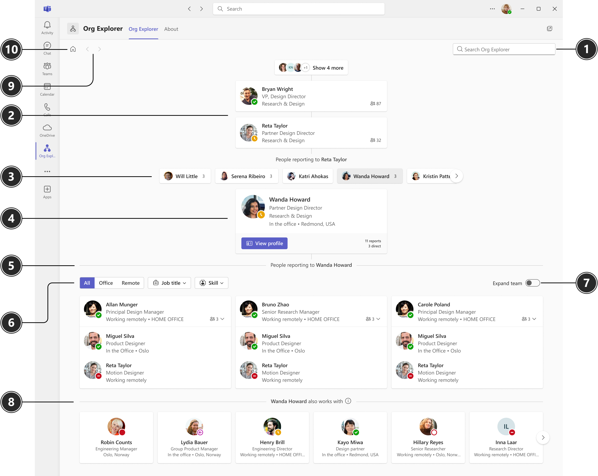
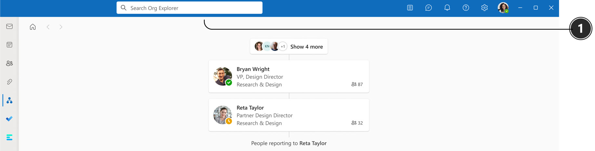
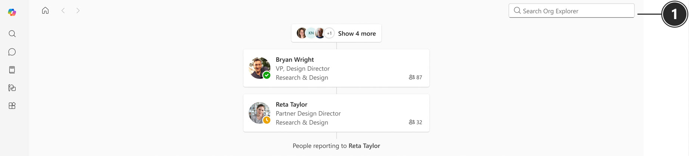

# Introducing Org Explorer
Org Explorer helps you visualize and explore your company’s internal structure, its teams, and people. It's available to all Microsoft 365 enterprise customers.

## Availability

Org Explorer is available in Microsoft Teams, Outlook, and Microsoft 365 Copilot. Its appearance varies slightly depending on which app you're in.

Microsoft Teams:

Outlook:

Microsoft 365 Copilot:

|#  |Element  |Function|
|----------|-----------|------------|
|1    |Search/People picker     |In Teams and the Microsoft 365 Copilot app (formerly Office): Type a person’s name or alias inside the People Picker and select from suggestions that appear.  **Note:** In Teams, the search box on the app toolbar isn’t limited to Org Explorer. We recommend using the People Picker within Org Explorer in Teams to ensure you're specifically searching within Org Explorer.  In Outlook: Type a person’s name or alias from the search box on the toolbar.|
|2|Manager chain   |The manger chain shows all the managers above the person in focus, The number of reports will show to the right of the person. Hover over the the number to view both direct and indirect reports.|
|3    |Peers       |Peers are people who report to the same manager as the person in focus. If the peer has people reporting to them, the number of reports will show. You can hover over the number to view both direct and indirect reports.  |
|4    |Person in focus    |When you select a person in Org Explorer, the page displays org information about them. For example, contact information, who their manager is, people reporting to them, and who they collaborate with. You can also select __View profile__ to view their [profile card](https://go.microsoft.com/fwlink/?linkid=2258586).   |
|5    |People reporting to       |People reporting to the person in focus are listed in the section below the person.       |
|6|Filters|Use the filters to refine the view. You can filter by working location, job title, and skills.  **Note:** Filters will only show if your organization has opted into People Skills.|
|7|Expand team       |Use the toggle to show/hide next-level reports.     |
|8|Works with|The people in the Works with section represent people who are [relevant to or working with the person in focus](/graph/people-insights-overview#including-a-person-as-relevant-or-working-with). The relevancy is based activities like in-common meetings, emails, and other collaboration patterns.|
|9|Navigation|Use the navigation buttons to scroll through your org browsing history in Org Explorer within your current session. These buttons will activate once you start navigating, either by using the search/picker or by clicking on the cards.  **Note:** The buttons are only active during your current session. If you refresh the page or start a new session, they'll reset.|
|10|Home|Select the Home button to see your own org chart and the people around you.  **Note:** If you’re viewing Org Explorer within a profile card, selecting the Home button will focus on the person whose profile card you're viewing. |

## Where is the organization information collected from?

The organizational information you see about users in Org Explorer is from Microsoft Entra ID – Microsoft Entra ID. [Learn more about user information](/graph/api/resources/users?).

## What if there's no organizational data set up in the Microsoft Entra ID?

If your organization doesn't include manager relationship data in the Microsoft Entra ID, the user won't be able to see the organization chart in Org Explorer. You can fill in the data from your HR system via the Microsoft Identity Manager provisioning system (MIM). [Learn more about Microsoft Identity Manager](/microsoft-identity-manager/microsoft-identity-manager-2016).

## How is the "Works With" data generated?

The data in the "Works With" section is based on public relationships, like in-common meetings, email, and other collaboration patterns. The insights are returned by the people API. To turn off the Works with section, see [Customizing people insights privacy in Microsoft Graph](/graph/insights-customize-people-insights-privacy).

## Setting up Org Explorer

 There's no specific set-up process for Org Explorer. Once it's deployed to your organization, the user can access Org Explorer app via Microsoft Teams, Outlook and Microsoft 365. 

## Removing Org Explorer

Admins can manage Org Explorer for their entire organization or a subset of users in the Microsoft Admin Center. [Learn more about admin controls](/microsoft-365/admin/manage/teams-apps-work-on-outlook-and-m365?view=o365-worldwide).   

## Additional resources

[Org Explorer](https://go.microsoft.com/fwlink/?linkid=2224220)

[Explore your organization](https://go.microsoft.com/fwlink/?linkid=2223751)

[Search for a person](https://go.microsoft.com/fwlink/?linkid=2224126)
